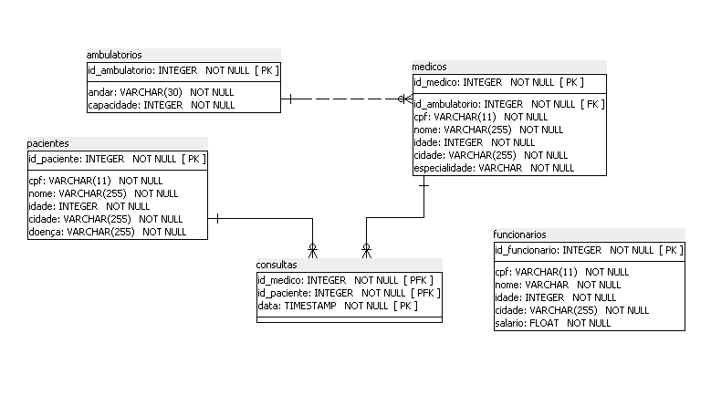

# Esquemas de exemplo

Aqui eu vou deixar as bases de esquemas utilizadas pelo professor em aula, com algumas modificações aos nomes de campos pra tentar arrumar um pouco da bagunça que ele faz as vezes.

##  Esquema hospital

